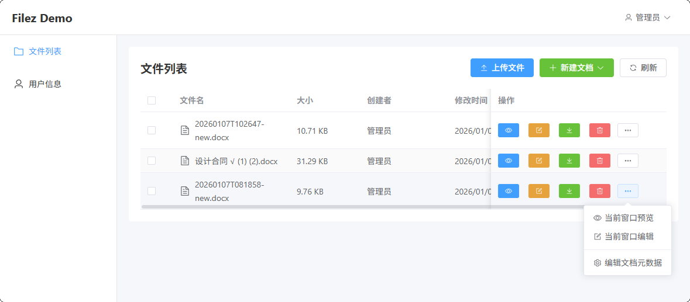
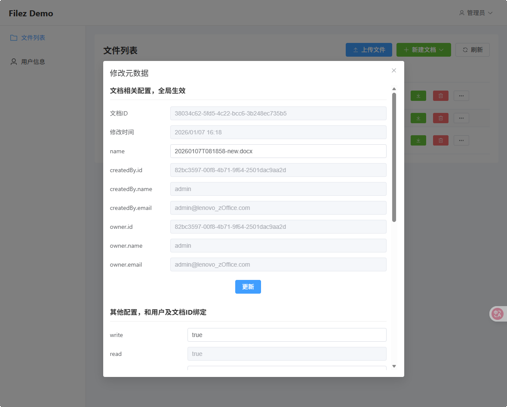

# Filez Demo (Node.js)

ZOffice 文档管理集成演示项目，基于 Node.js 技术栈实现，包含前后端完整功能。

示例：




## 📋 目录

- [项目简介](#项目简介)
- [技术栈](#技术栈)
- [项目结构](#项目结构)
- [功能特性](#功能特性)
- [快速开始](#快速开始)
- [Docker 部署](#docker-部署)
- [本地开发](#本地开发)
- [环境变量配置](#环境变量配置)
- [API 接口](#api-接口)
- [常见问题](#常见问题)

---

## 项目简介

本项目是 ZOffice 文档中台的第三方集成演示，展示如何将 ZOffice 在线文档编辑能力集成到业务系统中。支持：

- 文档在线预览和编辑
- 前端集成和标准集成两种模式
- 多用户协同编辑
- 文档版本管理

## 技术栈

### 后端 (Backend)

| 技术 | 说明 |
|------|------|
| Node.js 20 | 运行环境 |
| Koa 2 | Web 框架 |
| TypeScript | 开发语言 |
| TypeORM | ORM 框架 |
| SQLite | 数据库 |
| JWT | 身份认证 |
| Winston | 日志系统（支持日志轮转） |

### 前端 (Frontend)

| 技术 | 说明 |
|------|------|
| Vue 3 | 前端框架 |
| TypeScript | 开发语言 |
| Vite | 构建工具 |
| Element Plus | UI 组件库 |
| Axios | HTTP 客户端 |
| Pinia | 状态管理 |
| Vue Router | 路由管理 |

## 项目结构

```
filez-demo-nodejs/
├── backend/                    # 后端服务
│   ├── src/
│   │   ├── app.ts              # 应用入口
│   │   ├── config/             # 配置管理
│   │   ├── controller/         # 控制器（路由处理）
│   │   ├── service/            # 业务逻辑
│   │   ├── dao/                # 数据访问层
│   │   ├── entity/             # 数据库实体
│   │   ├── middleware/         # 中间件（认证、日志等）
│   │   ├── route/              # 路由定义
│   │   ├── database/           # 数据库配置和初始化
│   │   └── util/               # 工具函数
│   ├── config/                 # 配置文件（JSON）
│   ├── templates/              # 文档模板
│   └── docker-entrypoint.sh    # Docker 启动脚本
│
├── frontend/                   # 前端应用
│   ├── src/
│   │   ├── main.ts             # 入口文件
│   │   ├── App.vue             # 根组件
│   │   ├── views/              # 页面组件
│   │   ├── api/                # API 请求封装
│   │   ├── router/             # 路由配置
│   │   ├── store/              # 状态管理
│   │   ├── config/             # 前端配置
│   │   └── utils/              # 工具函数
│   └── public/                 # 静态资源
│
├── docker-compose.yml          # Docker Compose 配置
├── Dockerfile                  # Docker 多阶段构建
├── .env.example                # 环境变量示例
└── README.md
```

## 功能特性

### 用户管理
- 用户登录/登出
- JWT Token 认证
- 密码修改

### 文档管理
- 文档列表展示
- 新建文档（Word/Excel/PPT）
- 文档上传
- 文档删除
- 文档在线预览和编辑

### ZOffice 集成
- **前端集成模式**：通过 URL 参数传递文档信息，支持更灵活的定制
- **标准集成模式**：简化的集成方式，适合快速接入
- 文档内容上传/下载回调
- 文档元数据接口
- 用户信息接口
- 文档状态通知

---

## 快速开始

### 环境要求

- Docker 20.10+
- Docker Compose 2.0+
- （本地开发）Node.js 20+

### 默认账号

- 用户名：`admin`
- 密码：`zOffice`

---

## Docker 部署

### 方式一：使用 Docker Compose（推荐）

```bash
# 1. 克隆项目
git clone <repository-url>
cd filez-demo-nodejs

# 2. 复制并配置环境变量
cp .env.example .env
# 编辑 .env 文件，配置 ZOffice 服务地址等

# 3. 构建并启动
docker compose up -d --build

# 4. 查看日志
docker compose logs -f

# 5. 访问服务
# http://localhost:8000
```

### 方式二：手动构建镜像

```bash
# 1. 构建镜像
docker build -t filez-demo-nodejs .

# 2. 创建数据目录
mkdir -p ./docker-data/{data,uploads,logs}

# 3. 运行容器
docker run -d \
  --name filez-demo-nodejs \
  -p 8000:8000 \
  -v $(pwd)/docker-data/data:/app/data \
  -v $(pwd)/docker-data/uploads:/app/uploads \
  -v $(pwd)/docker-data/logs:/app/logs \
  --env-file .env \
  filez-demo-nodejs
```

### 常用 Docker 命令

```bash
# 查看容器状态
docker compose ps

# 查看实时日志
docker compose logs -f

# 重新构建（代码更新后）
docker compose up -d --build

# 强制重新构建（清除缓存）
docker compose build --no-cache
docker compose up -d

# 停止服务
docker compose down

# 停止并删除数据卷（谨慎！会删除数据）
docker compose down -v

# 进入容器
docker exec -it filez-demo-nodejs sh

# 查看容器内日志文件
docker exec -it filez-demo-nodejs ls -la /app/logs
```

### 部署注意事项

1. **端口配置**
   - 默认端口 8000，可通过 `.env` 文件中的 `LS_SERVER_PORT` 修改
   - 确保防火墙开放对应端口

2. **数据持久化**
   - 数据库文件：`./docker-data/data/filez_demo.db`
   - 上传文件：`./docker-data/uploads/`
   - 日志文件：`./docker-data/logs/`
   - 首次部署前请确保目录存在或让 Docker 自动创建

3. **ZOffice 服务配置**
   - 必须正确配置 `LS_ZOFFICE_HOST` 和 `LS_ZOFFICE_PORT`
   - 确保本机能够访问 ZOffice 服务
   - `LS_DEMO_HOST` 应配置为本服务的可访问 IP（ZOffice 需要回调）

4. **安全建议**
   - 生产环境务必修改 `LS_JWT_SECRET` 和 `LS_SESSION_SECRET`
   - 建议修改默认管理员密码

---

## 本地开发

### 启动后端

```bash
cd backend

# 安装依赖
npm install

# 初始化数据库（首次运行）
npm run seed

# 启动开发服务器（热重载）
npm run dev
```

后端默认运行在 http://localhost:8000

### 启动前端

```bash
cd frontend

# 安装依赖
npm install

# 启动开发服务器
npm run dev
```

前端默认运行在 http://localhost:5173，自动代理 API 请求到后端

### 构建生产版本

```bash
# 后端
cd backend && npm run build

# 前端
cd frontend && npm run build
```

---

## 环境变量配置

复制 `.env.example` 为 `.env`，根据实际环境修改：

| 变量名 | 说明 | 默认值 |
|--------|------|--------|
| **服务器配置** |||
| `LS_SERVER_PORT` | 服务端口 | `8000` |
| `LS_SERVER_ENV` | 运行环境 | `production` |
| **日志配置** |||
| `LS_LOG_DIR` | 日志目录 | `/app/logs` |
| `LS_LOG_LEVEL` | 日志级别 | `info` |
| **安全配置** |||
| `LS_JWT_SECRET` | JWT 密钥 | 内置默认值 |
| `LS_SESSION_SECRET` | Session 密钥 | 内置默认值 |
| **ZOffice 配置** |||
| `LS_ZOFFICE_HOST` | ZOffice 服务地址 | `172.16.34.165` |
| `LS_ZOFFICE_PORT` | ZOffice 服务端口 | `8001` |
| `LS_ZOFFICE_APP_SECRET` | HMAC 签名密钥 | `default-salt` |
| `LS_ZOFFICE_APP_FEINTEGRATION_ENABLE` | 是否启用前端集成 | `true` |
| **Demo 配置** |||
| `LS_DEMO_HOST` | 本服务可访问 IP | `172.16.34.165` |
| `LS_DEMO_REPOID` | 仓库 ID | `3rd-party` |
| **管理员配置** |||
| `LS_ADMIN_USERNAME` | 管理员用户名 | `admin` |
| `LS_ADMIN_PASSWORD` | 管理员密码 | `zOffice` |

---

## API 接口

### 认证接口

| 方法 | 路径 | 说明 |
|------|------|------|
| POST | `/api/auth/login` | 用户登录 |
| POST | `/api/auth/logout` | 用户登出 |
| GET | `/api/auth/profile` | 获取当前用户信息 |

### 文档接口

| 方法 | 路径 | 说明 |
|------|------|------|
| GET | `/api/docs` | 获取文档列表 |
| POST | `/api/docs` | 创建新文档 |
| POST | `/api/docs/upload` | 上传文档 |
| DELETE | `/api/docs/:id` | 删除文档 |

### ZOffice 集成接口

| 方法 | 路径 | 说明 |
|------|------|------|
| GET | `/v2/context/driver-cb` | 获取 ZOffice 编辑 URL |
| GET | `/v2/context/:docId/content` | 下载文档内容 |
| POST | `/v2/context/:docId/content` | 上传编辑后的文档 |
| GET | `/v2/context/:docId/meta` | 获取文档元数据 |
| GET | `/v2/context/profiles` | 获取用户信息 |
| POST | `/v2/context/:docId/notify` | 文档状态通知 |

---

## 常见问题

### 1. 登录提示 401

- 检查数据库是否正确初始化
- 删除 `docker-data/data/filez_demo.db` 后重启容器

### 2. 文档无法打开/编辑

- 检查 `LS_ZOFFICE_HOST` 配置是否正确
- 确保 ZOffice 服务可访问
- 检查 `LS_DEMO_HOST` 是否配置为本服务的可访问 IP

### 3. 端口被占用

```bash
# 查看端口占用
lsof -i :8000
# 或
netstat -tlnp | grep 8000

# 终止占用进程
kill -9 <PID>
```

### 4. Docker 构建失败

```bash
# 清除 Docker 构建缓存
docker builder prune -f

# 重新构建
docker compose build --no-cache
```

### 5. 日志文件未生成

- 确保 `docker-data/logs` 目录存在且有写权限
- 检查容器日志：`docker compose logs -f`

---

## License

MIT
